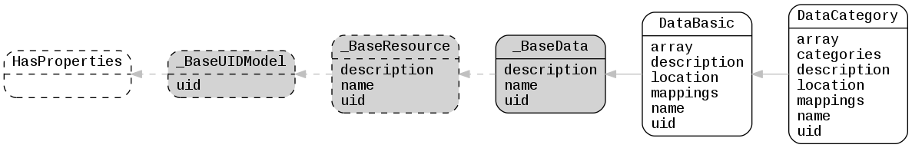

.. _lfview_resources_spatial_data:

Data Resources
************************************************************************
Data objects that hold numeric attributes and mapping to elements

Doc links:
:class:`_BaseData <lfview.resources.spatial.data._BaseData>`
:class:`_BaseResource <lfview.resources.spatial.base._BaseResource>`
:class:`_BaseUIDModel <lfview.resources.files.base._BaseUIDModel>`
:class:`DataBasic <lfview.resources.spatial.data.DataBasic>`
:class:`DataCategory <lfview.resources.spatial.data.DataCategory>`
:class:`HasProperties <properties.HasProperties>`

.. autoclass:: lfview.resources.spatial.data._BaseData

.. autoclass:: lfview.resources.spatial.data.DataBasic

.. autoclass:: lfview.resources.spatial.data.DataCategory
