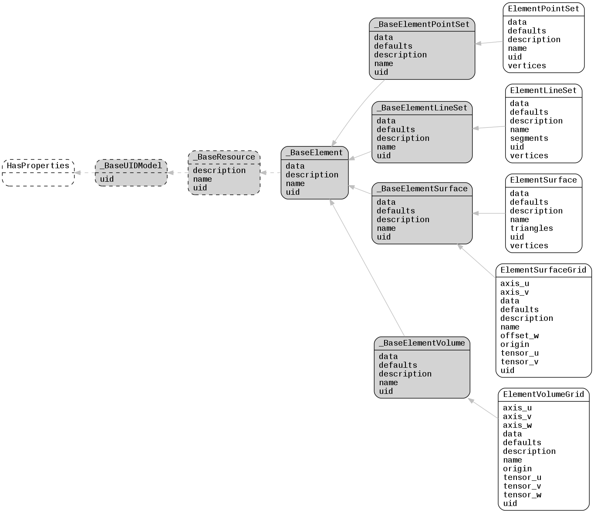

.. _lfview_resources_spatial_elements:

Elements Resources
************************************************************************
3D spatial element classes that hold object geometry and associated data

Doc links:
:class:`_BaseElement <lfview.resources.spatial.elements._BaseElement>`
:class:`_BaseElementLineSet <lfview.resources.spatial.elements._BaseElementLineSet>`
:class:`_BaseElementPointSet <lfview.resources.spatial.elements._BaseElementPointSet>`
:class:`_BaseElementSurface <lfview.resources.spatial.elements._BaseElementSurface>`
:class:`_BaseElementVolume <lfview.resources.spatial.elements._BaseElementVolume>`
:class:`_BaseResource <lfview.resources.spatial.base._BaseResource>`
:class:`_BaseUIDModel <lfview.resources.files.base._BaseUIDModel>`
:class:`ElementLineSet <lfview.resources.spatial.elements.ElementLineSet>`
:class:`ElementPointSet <lfview.resources.spatial.elements.ElementPointSet>`
:class:`ElementSurface <lfview.resources.spatial.elements.ElementSurface>`
:class:`ElementSurfaceGrid <lfview.resources.spatial.elements.ElementSurfaceGrid>`
:class:`ElementVolumeGrid <lfview.resources.spatial.elements.ElementVolumeGrid>`
:class:`HasProperties <properties.HasProperties>`

.. autoclass:: lfview.resources.spatial.elements._BaseElement

.. autoclass:: lfview.resources.spatial.elements._BaseElementPointSet

.. autoclass:: lfview.resources.spatial.elements._BaseElementLineSet

.. autoclass:: lfview.resources.spatial.elements._BaseElementSurface

.. autoclass:: lfview.resources.spatial.elements._BaseElementVolume

.. autoclass:: lfview.resources.spatial.elements.ElementPointSet

.. autoclass:: lfview.resources.spatial.elements.ElementLineSet

.. autoclass:: lfview.resources.spatial.elements.ElementSurface

.. autoclass:: lfview.resources.spatial.elements.ElementSurfaceGrid

.. autoclass:: lfview.resources.spatial.elements.ElementVolumeGrid
