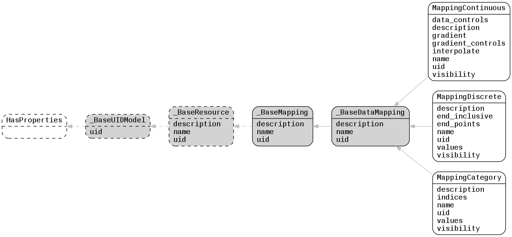

.. _lfview_resources_spatial_mappings:

Mappings Resources
************************************************************************
Objects that map a data array to attributes for visualization

Doc links:
:class:`_BaseDataMapping <lfview.resources.spatial.mappings._BaseDataMapping>`
:class:`_BaseMapping <lfview.resources.spatial.mappings._BaseMapping>`
:class:`_BaseResource <lfview.resources.spatial.base._BaseResource>`
:class:`_BaseUIDModel <lfview.resources.files.base._BaseUIDModel>`
:class:`HasProperties <properties.HasProperties>`
:class:`MappingCategory <lfview.resources.spatial.mappings.MappingCategory>`
:class:`MappingContinuous <lfview.resources.spatial.mappings.MappingContinuous>`
:class:`MappingDiscrete <lfview.resources.spatial.mappings.MappingDiscrete>`

.. autoclass:: lfview.resources.spatial.mappings._BaseMapping

.. autoclass:: lfview.resources.spatial.mappings._BaseDataMapping

.. autoclass:: lfview.resources.spatial.mappings.MappingContinuous

.. autoclass:: lfview.resources.spatial.mappings.MappingDiscrete

.. autoclass:: lfview.resources.spatial.mappings.MappingCategory
