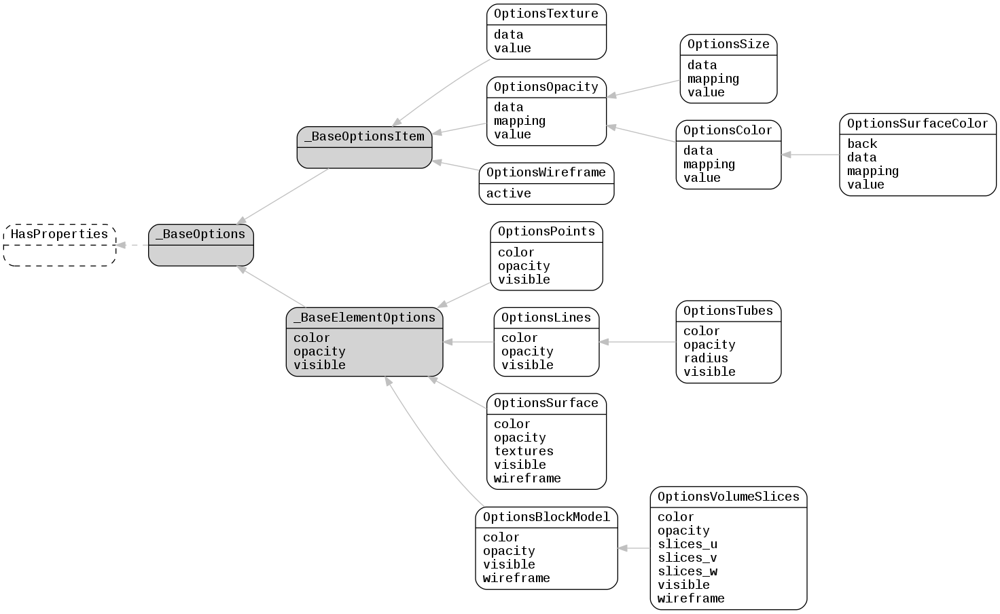

.. _lfview_resources_spatial_options:

Options Resources
************************************************************************
Objects that define visualization options

Doc links:
:class:`_BaseElementOptions <lfview.resources.spatial.options._BaseElementOptions>`
:class:`_BaseOptions <lfview.resources.spatial.options._BaseOptions>`
:class:`_BaseOptionsItem <lfview.resources.spatial.options._BaseOptionsItem>`
:class:`HasProperties <properties.HasProperties>`
:class:`OptionsBlockModel <lfview.resources.spatial.options.OptionsBlockModel>`
:class:`OptionsColor <lfview.resources.spatial.options.OptionsColor>`
:class:`OptionsLines <lfview.resources.spatial.options.OptionsLines>`
:class:`OptionsOpacity <lfview.resources.spatial.options.OptionsOpacity>`
:class:`OptionsPoints <lfview.resources.spatial.options.OptionsPoints>`
:class:`OptionsSize <lfview.resources.spatial.options.OptionsSize>`
:class:`OptionsSurface <lfview.resources.spatial.options.OptionsSurface>`
:class:`OptionsSurfaceColor <lfview.resources.spatial.options.OptionsSurfaceColor>`
:class:`OptionsTexture <lfview.resources.spatial.options.OptionsTexture>`
:class:`OptionsTubes <lfview.resources.spatial.options.OptionsTubes>`
:class:`OptionsVolumeSlices <lfview.resources.spatial.options.OptionsVolumeSlices>`
:class:`OptionsWireframe <lfview.resources.spatial.options.OptionsWireframe>`

.. autoclass:: lfview.resources.spatial.options._BaseOptions

.. autoclass:: lfview.resources.spatial.options._BaseOptionsItem

.. autoclass:: lfview.resources.spatial.options.OptionsTexture

.. autoclass:: lfview.resources.spatial.options.OptionsOpacity

.. autoclass:: lfview.resources.spatial.options.OptionsSize

.. autoclass:: lfview.resources.spatial.options.OptionsColor

.. autoclass:: lfview.resources.spatial.options.OptionsSurfaceColor

.. autoclass:: lfview.resources.spatial.options.OptionsWireframe

.. autoclass:: lfview.resources.spatial.options._BaseElementOptions

.. autoclass:: lfview.resources.spatial.options.OptionsPoints

.. autoclass:: lfview.resources.spatial.options.OptionsLines

.. autoclass:: lfview.resources.spatial.options.OptionsTubes

.. autoclass:: lfview.resources.spatial.options.OptionsSurface

.. autoclass:: lfview.resources.spatial.options.OptionsBlockModel

.. autoclass:: lfview.resources.spatial.options.OptionsVolumeSlices
