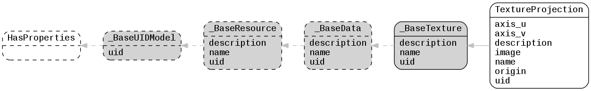

.. _lfview_resources_spatial_textures:

Textures Resources
************************************************************************
Texture data objects that place images on elements

Doc links:
:class:`_BaseData <lfview.resources.spatial.data._BaseData>`
:class:`_BaseResource <lfview.resources.spatial.base._BaseResource>`
:class:`_BaseTexture <lfview.resources.spatial.textures._BaseTexture>`
:class:`_BaseUIDModel <lfview.resources.files.base._BaseUIDModel>`
:class:`HasProperties <properties.HasProperties>`
:class:`TextureProjection <lfview.resources.spatial.textures.TextureProjection>`

.. autoclass:: lfview.resources.spatial.textures._BaseTexture

.. autoclass:: lfview.resources.spatial.textures.TextureProjection
